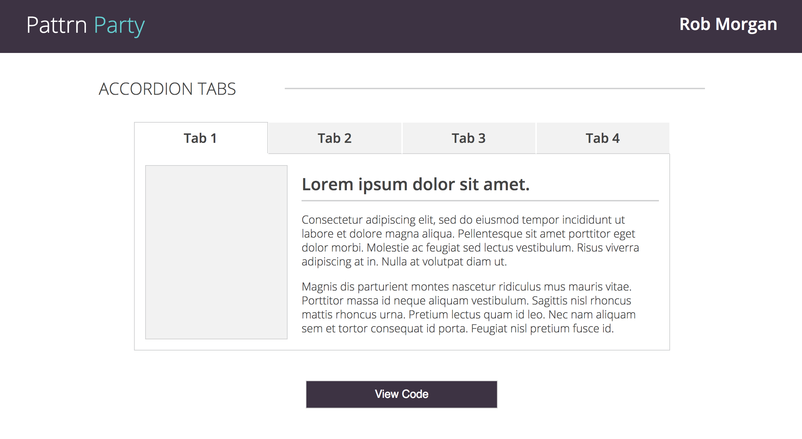

## Pattrn Party

Pattrn Party is a set of 3 style guides:
 
  **1.  Accordion Tabs**
 
  **2.  Flexible Cards**
 
  **3.  Header Bar**

They are built to an exact spec and would be easy to repurpose for any project.  Each style guide works on all screen sizes.  There is one main breakpoint at 768px (tablet size).  Anything smaller is considered a mobile version and has mobile-specific styling.

Check out the live version: https://rmorgan323.github.io/pattrn-party/

